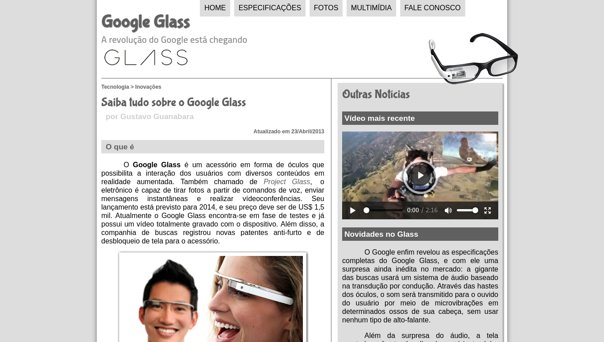

# :eyeglasses: Google Glass

> :us: If you prefer to read in another language, this README was also written in english. Click [HERE](/README.md) to access.

*Esse foi um projeto desenvolvido durante o curso HTML5 do [Curso em Vídeo](https://www.cursoemvideo.com/).*

## :play_or_pause_button: O que é o Curso em Vídeo?

O CeV é um projeto idealizado pelo professor Gustavo Guanabara com o intuito de levar educação de qualidade a qualquer um que tenha acesso à internet.

[Site](https://www.cursoemvideo.com/) | [Canal no YouTube](https://www.youtube.com/user/cursosemvideo)

## :dart: Objetivo

O Google é uma das empresas de tecnologia mais importantes do momento e, ao apresentar o Google Glass, ela mostrou ao mundo o "por quê" disso.

## :scroll: Alguns detalhes 

### :desktop_computer: Sobre o projeto

* O front end é feito com HTML5, CSS3 e JavaScript.

### :book: Sobre o curso

É um curso básico mas não deixa de ser completo dado o seu público alvo. O professor Gustavo Guanabara tem uma ótima didática e o curso está disponível gratuitamente na internet.

[Curso no Youtube](https://www.youtube.com/playlist?list=PLHz_AreHm4dlAnJ_jJtV29RFxnPHDuk9o) | [Curso no Site](https://www.cursoemvideo.com/course/html5/)

## :thinking: Como rodar o projeto em minha máquina?

O primeiro passo é clonar o projeto, seja via terminal ou GitHub Desktop, ou mesmo baixando o arquivo compactado (.zip). Após isso, siga  adiante.

### :hammer_and_wrench: Requisitos

Não há requisitos para executar o projeto em seu computador! Basta dar dois cliques no arquivo *index.html* que ele será aberto em seu navegador padrão.

## :tada: Se tudo deu certo...

Agora você está o projeto rodando lindamente!
